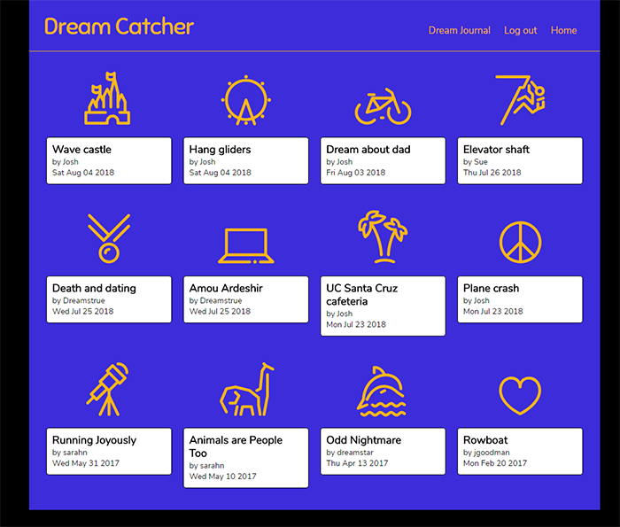
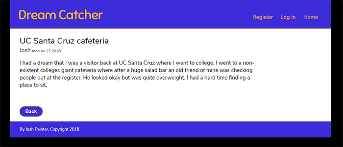
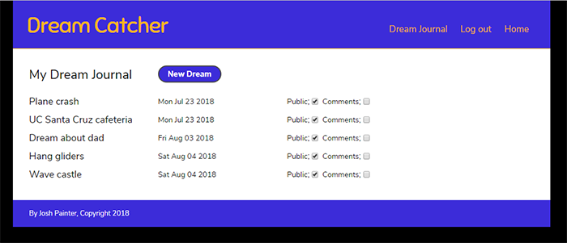
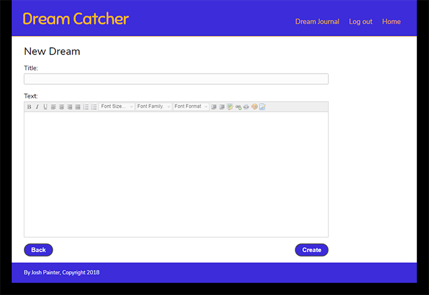

# Dream Catcher

## Live App:

[https://afternoon-wave-33296.herokuapp.com/](https://afternoon-wave-33296.herokuapp.com/)

## Summary:

Dream Catcher is a combined private dream journal and public dream repository. A user can create and maintain a list of dream for themselves using a rich text editor. The dreams can be set to be public, where the will be available for public viewing on the home screen. A public dream can be set to be open to comments so registered users will be able to leave comments. A user can delete comments made on their dreams and also their own comments on other dreams.

## Motivation:

I created this app from my own interest in keeping a dream journal and prefer to keep digital records rather than using pen and paper. Dream journaling is rewarding way to record interesting memories and learn more about oneself. Although there are dream journal apps available, I believe that this is the first one that allows the user to publish dreams and browse through other people’s dreams as well.

## Technologies Used:

This app is single-page and uses jquery on the front-end. The front end communicates to the back end through a REST api. The back end was created with Node.js and the Express.js framework. Passport.js is used for local and json web token authentication. The database used is Mongodb and mongoose is used for an object data manager. The Github source repository is integrated with TravisCI for integration testing and builds. TravisCI is integrated with Heroku for deployment. The MongoDB database is hosted at mLab. The app contains 52 integration tests created with the Mocha test framework and the Chai assertion library.

## Screenshots:

Home screen:

Dream detail:

Dream journal:

Dream editor

## API Documentation

POST /login - for user authetication

POST /users - for user account creation

GET /users - for retrieval of an authenticated user’s non-sensitive account information

GET /dreams - allows an unauthenticated user to get public dreams or an authenticated user to get public dreams or their personal dream list

GET /dreams/:id - retrieve dream details of public dreams or private dreams of authenticated user

POST /dreams - create dream for authenticated user

PUT /dreams - update dream of authenticated user 

DELETE /dreams - delete dream of authenticated user 

POST /dreams/:id/comments - create a comment on a particular dream

DELETE /dreams/:id/comments/:comment_id - delete a comment from a particular dream

## Author:

Josh Painter
